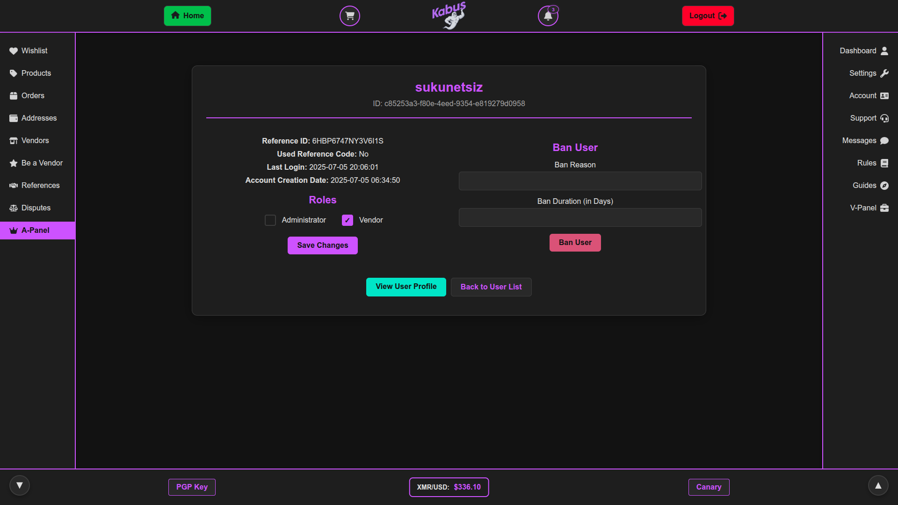
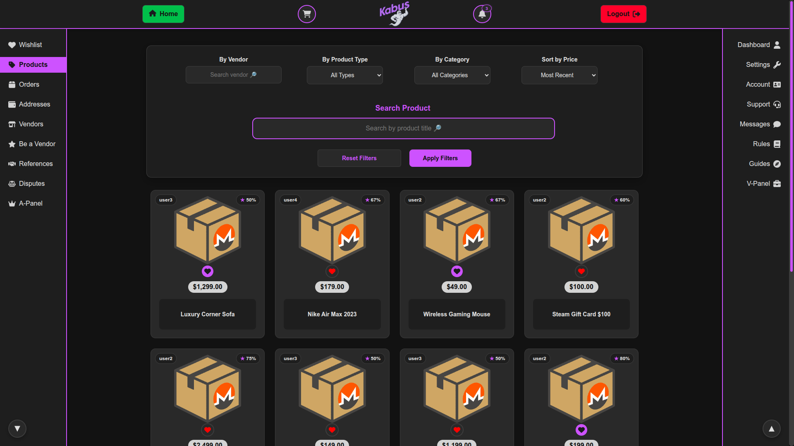

[View the Roadmap](docs/ROADMAP.md)
[Installation Guide](docs/INSTALLATION.md)
[Monero Wallet RPC Guide](docs/CONNECTING-MONERO-RPC.md)

# Kabus - Monero Marketplace Script

## Introduction

The purpose of creating Kabus was to contribute to the Monero ecosystem and ensure its growth. It was never created for any illegal purpose, nor does it encourage such activities. The aim of this marketplace script is to facilitate the sale of legal products online as anonymously as possible.

Built with PHP 8.3 and Laravel 11.

## Core Features

### Security & Privacy
- **PGP Integration**: Optional PGP key functionality for vendors and users to verify key ownership
- **Two-Factor Authentication**: Enhanced security through PGP-based 2FA
- **Mnemonic Recovery**: Built-in mnemonic phrase generation for key recovery
- **JavaScript Warning**: Optional JavaScript disable warning for privacy-conscious users
- **Unique Rhombus-Captcha**: Advanced anti-DDoS protection system



### Monero Integration
- **Vendor Registration Payment**: Monero Wallet RPC integration that generates a wallet address for vendor fee payments, with support for separate transactions and a 24-hour payment window
- **Return Address System**: Simple validation for user's Monero return addresses

*Note: Product purchasing with Monero is planned for future updates. Currently, Monero integration is only used for vendor registration fees.*



### Marketplace Functions
- **User Dashboard**: Comprehensive control panel for account management
- **Vendor Profiles**: Vendor pages with product listings
- **Product Management**: Search functionality and wishlist feature
- **Messaging System**: Secure communication between users
- **Admin Panel**: Complete administrative control interface
- **Vendor Panel**: Dedicated interface for vendor operations

### Additional Features
- **Reference System**: Optional referral code requirement for registration
- **Educational Resources**: Comprehensive guides on Monero usage, KeePassXC for new users
- **Support System**: Integrated help desk functionality

---

```
Privacy is a human right, and it can never be taken away from anyone, nor should it even be suggested.
```
