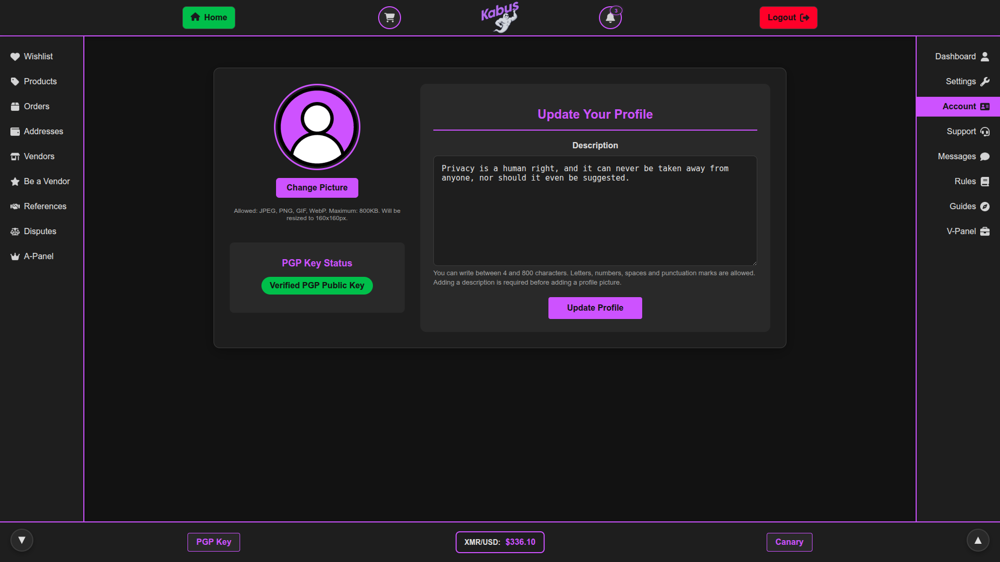
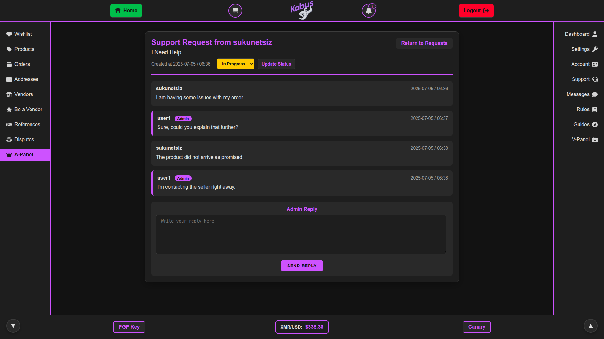
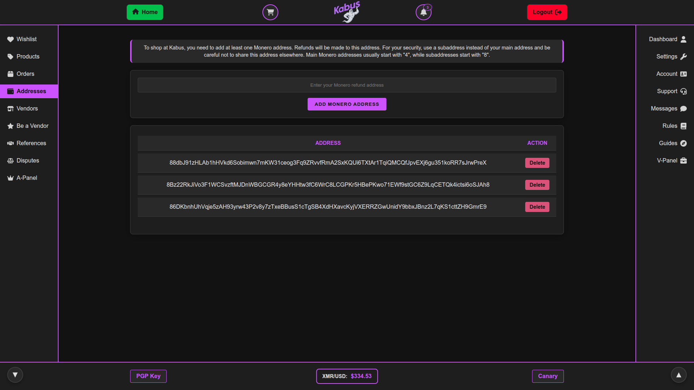
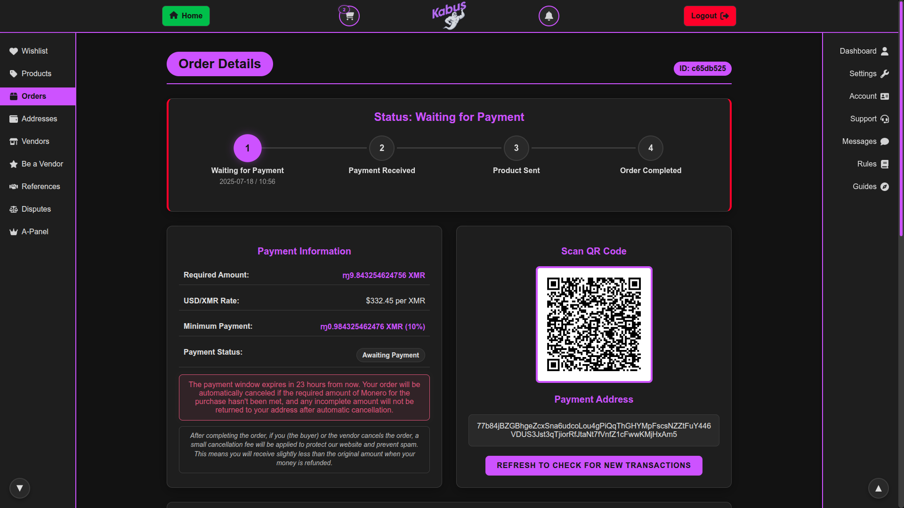
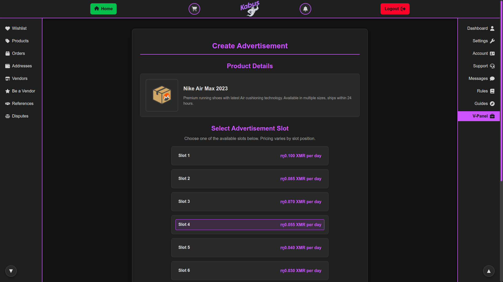
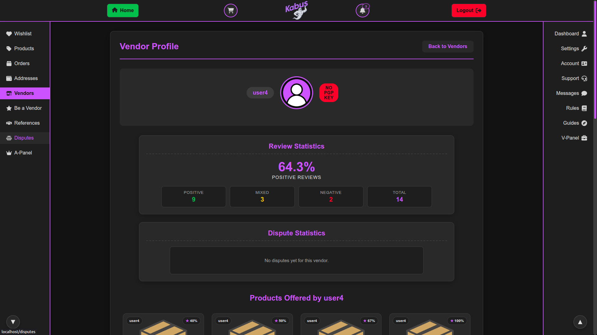
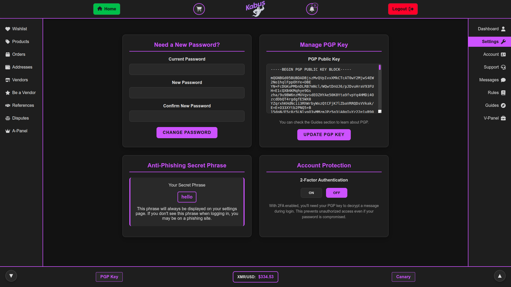
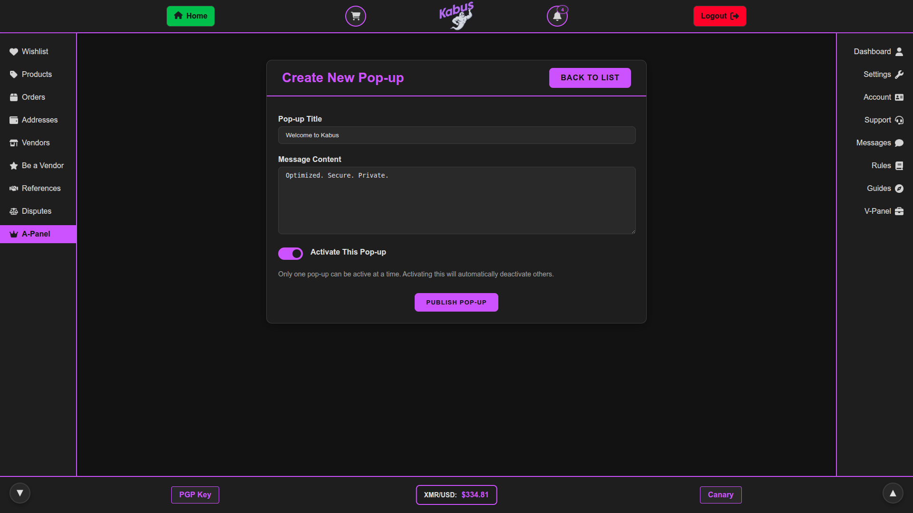
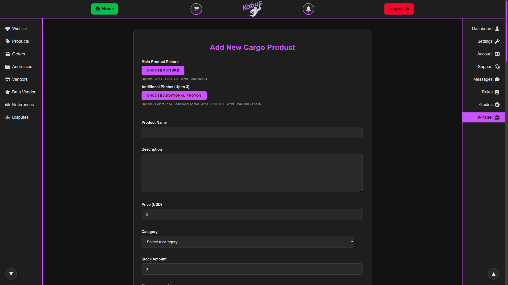

<div align="center">
  <h1><a href="docs/INSTALLATION.md">Installation Guide</a></h1>
</div>

<div align="center">
  
</div>

<div align="center">
  <h1>Kabus - Monero Marketplace Script</h1>
</div>

## Introduction

The purpose of creating Kabus was to contribute to the Monero ecosystem and ensure its growth. It was never created for any illegal purpose, nor does it encourage such activities. The aim of this marketplace script is to facilitate the sale of legal products online as anonymously as possible.

Built with PHP 8.3 and Laravel 11.

## Project Status and Future Direction

Due to minimal donations, I have decided to discontinue active development of Kabus as an open-source project. Maintaining and enhancing this marketplace script requires significant time and resources, and without adequate community backing, it is no longer sustainable to continue development using my personal time while managing other financial obligations.

**The Kabus repository will remain open-source and available for use.** You are free to fork, modify, and use the existing codebase according to the project's license terms.

### Introducing Kabus-X

Moving forward, I am developing Kabus-X, which will be a premium, paid Monero marketplace script featuring:

- Advanced security implementations
- Enhanced performance optimizations
- Exclusive features not available in the open-source version
- Regular updates and improvements

For more information about Kabus-X, including services, custom development, and portfolio showcase, please visit: https://github.com/sukunetsiz/kabus-x-studio

## Core Features

### Monero Integration
- **Vendor Registration Payment**: Monero Wallet RPC integration that generates a wallet address for vendor fee payments, with support for separate transactions and a 24-hour payment window
- **Product Advertising Payment**: Integrated payment system for vendors to advertise their products on the homepage through Monero transactions
- **Product Purchasing**: Integrated Monero payment system for secure and anonymous product transactions
- **Return Address System**: Validation for user's Monero return addresses

### Marketplace Functions
- **User Dashboard**: Comprehensive control panel for account management
- **Vendor Profiles**: Vendor pages with product listings
- **Product Management**: Search functionality and wishlist feature
- **Messaging System**: Secure communication between users
- **Admin Panel**: Complete administrative control interface
- **Vendor Panel**: Dedicated interface for vendor operations
- **Reference System**: Optional referral code requirement for registration
- **Educational Resources**: Comprehensive guides on Monero, Tor, KeePassXC and Kleopatra usage for new users
- **Support System**: Integrated help desk functionality
- **Disputes System**: Facilitates resolution of order-related issues between buyers and vendors with administrative intervention when necessary

### Security & Privacy
- **Walletless Escrow System**: No user wallets; payments are made per order and escrowed until order resolution
- **PGP Integration**: Mandatory PGP key confirmation for vendors to verify key ownership
- **Two-Factor Authentication**: Enhanced security through PGP-based 2FA
- **Mnemonic Recovery**: Built-in mnemonic phrase generation for key recovery
- **No JavaScript**: Built entirely with pure PHP and does not utilize JavaScript in any capacity

### Screenshots


---

---

---

---

---

---

---

---

---

---

---

---

---

---

---

---

<div align="center">
  <h1><a href="docs/CONNECTING-MONERO-RPC.md">Monero Wallet RPC Guide</a></h1>
</div>

### Legacy Support

While active development of Kabus has concluded, the open-source codebase remains available for community use. If you're using the existing code:

- **Monero Donations**: Direct support through Monero payments
- **Donation Address:** `89p3o8Umho9haXyAJHMwrfeeqea2UoJaZ6sknFvYVAitMFKJYTW54huh1enTQHBwdaWq5duyZ4ZsZjVcHQyiRZmfGbQMhce`
- **Code Contributions**: Community pull requests and improvements are still welcome
- **Bug Reports**: Issues can be reported for community visibility and potential fixes
- **Community Fork**: Users are encouraged to fork and maintain their own versions

*For professional support and ongoing development, consider Kabus-X.*

---

```
Privacy is a human right, and it can never be taken away from anyone, nor should it even be suggested.
```
